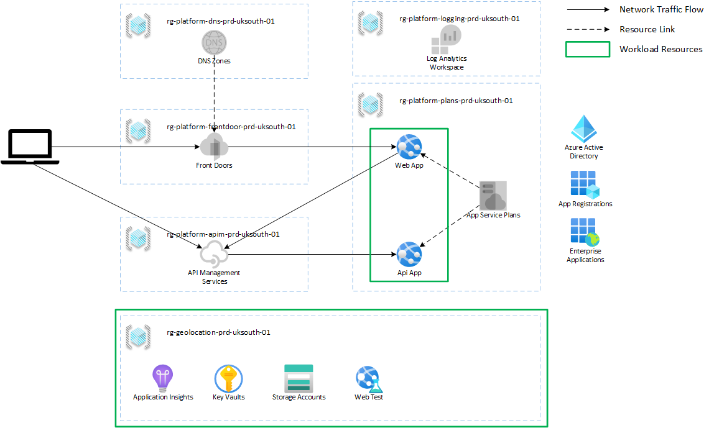

# GeoLocation Service

| Stage | Status |
| --- | --- |
| Code Quality |  |
| Build |  |
| Development |  |
| Production |  |

---

## Overview

This repository contains a simple GeoLocation service that is backed by the MaxMind service. It exists as a caching layer to reduce cost and improve performance.

The primary use-case for integration with the [xtremeidiots-portal](https://github.com/frasermolyneux/xtremeidiots-portal) solution. As many lookups may be done against the same connected players this can become costly.

---

## Related Projects

* [frasermolyneux/azure-landing-zones](https://github.com/frasermolyneux/azure-landing-zones) - The deploy service principal is managed by this project, as is the workload subscription.
* [frasermolyneux/xtremeidiots-portal](https://github.com/frasermolyneux/xtremeidiots-portal) - The xtremeidiots-portal project is the primary project that uses the GeoLocation service.
* [frasermolyneux/platform-connectivity](https://github.com/frasermolyneux/platform-connectivity) - The platform connectivity project provides DNS and Azure Front Door shared resources.
* [frasermolyneux/platform-strategic-services](https://github.com/frasermolyneux/platform-strategic-services) - The platform strategic services project provides a shared services such as API Management and App Service Plans.

---

## Architecture

* This workload is deployed to the shared Molyneux.IO platform; as such services such as `Azure Front Door`, `API Management`, `App Service Plans` and `Log Analytics Workspace` are already deployed. This workload will either extend them or integrate with them.
* The `Web App` is a public-facing ASP .NET 7 website that allows geo location lookups.
  * No authentication is required for the application
* The `API App` is a .NET 7 Web Api that performs the geo location lookups using the MaxMind service.
  * AAD authentication is required for the application.
* The GeoLocation API is published to API Management and will require AAD Authentication and Subscription Keys.

---

## Azure Pipelines

The `one-pipeline` is within the `.azure-pipelines` folder and output is visible on the [frasermolyneux/Personal-Public](https://dev.azure.com/frasermolyneux/Personal-Public/_build?definitionId=170) Azure DevOps project.
The `.github` folder contains `dependabot` configuration and some code quality workflows.

---

## Contributing

Please read the [contributing](CONTRIBUTING.md) guidance; this is a learning and development project.

---

## Security

Please read the [security](SECURITY.md) guidance; I am always open to security feedback through email or opening an issue.
